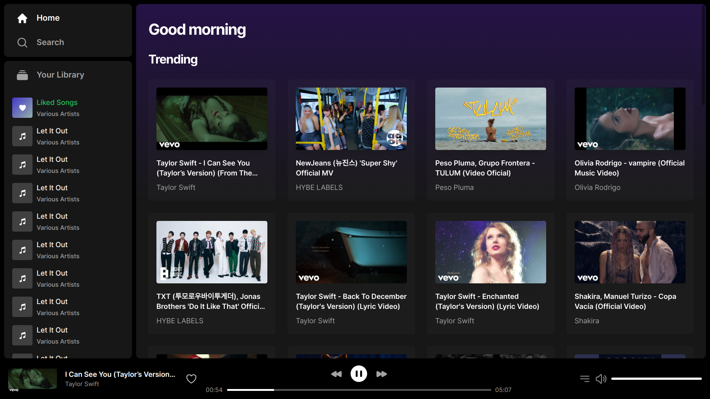
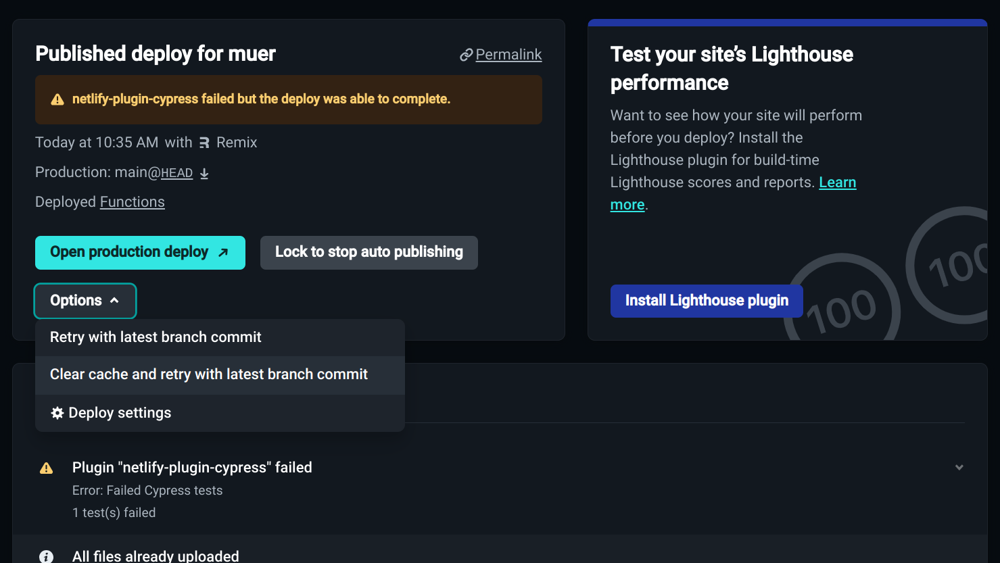

# Carson Vault, a fork of Muer
[](https://github.com/codespaces/new/muer-org/muer?quickstart=1)

Muer is a modern, open-source music player for you and your friends. 

Features:
- Beautiful UI/UX
- Music from Youtube
- Self-hosted
- Default fallback to Youtube embedded player

Muer is based on Invidious.



# Development
Run following commands to start coding & contributing to Muer
```sh
git clone https://github.com/muer-org/muer # Clone the repo
cd muer
npm install # Install dependencies
cp .env.sample .env # Create the .env file
npm run dev # Start the development server
```

# Hosting

By hosting Muer on various platforms, you help ensure the future of this project. While we use Netlify by default due to its simplicity and speed, we highly encourage individuals to explore and document their experiences with running Muer on alternative platforms.

## Host on Netlify
Fork the repo and copy the text to a variable.

<a href="public/screenshot_deploy_again.png"></a>


## Self-hosting
Guide to start production server on your own machine.

### Method 1: Clone & Run
```sh
git clone https://github.com/muer-org/muer # Clone the repo
cd muer
npm install # Install dependencies
cp .env.sample .env # Create the .env file
cp remix.config.selfhost.js remix.config.js # Use the self-hosting config
npm run build
npm run selfhost
```

### Method 2: Docker
```sh
docker run -p 3000:3000 muerorg/muer
```

## Host on other platforms
You can read these guides to start experimenting with other platforms:
- https://remix.run/docs/en/main/file-conventions/remix-config#serverbuildtarget
- https://vercel.com/guides/migrate-to-vercel-from-netlify
- https://developers.cloudflare.com/pages/migrations/migrating-from-netlify/
- https://github.com/dokku/dokku
- https://github.com/coollabsio/coolify
